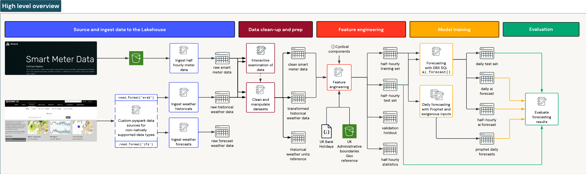
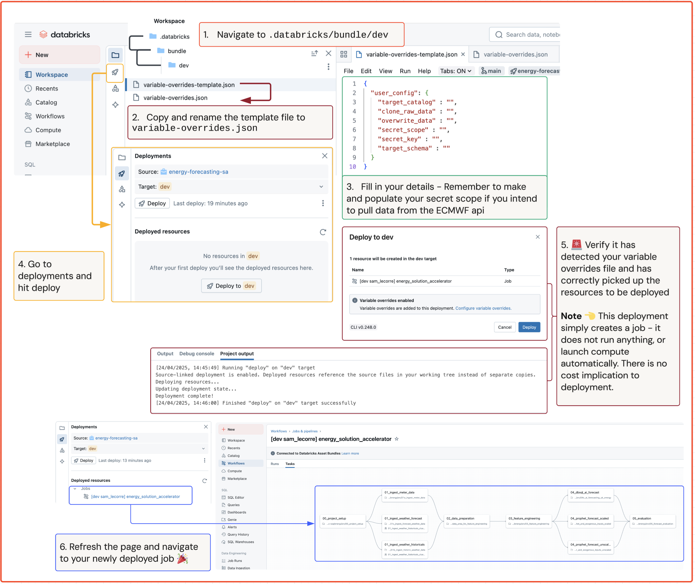

# UK Energy Trading Solution Accelerator

## Business Problem

The UK's transition to Market-Wide Half-Hourly Settlement (MHHS) marks a significant regulatory shift aimed at modernising electricity billing and promoting a more flexible, efficient energy market. Under MHHS, all electricity consumption data will be settled on a half-hourly basis, reflecting actual usage patterns in near-real time.

For energy suppliers, this change introduces both opportunities and challenges. Accurate forecasting becomes mission-critical: suppliers must predict customer demand at granular 30-minute intervals to manage their trading positions effectively. Forecasting errors can lead to imbalanced positions—buying too much or too little power—which exposes suppliers to costly imbalance charges and volatile trading prices in wholesale markets.

In this new landscape, the ability to harness smart meter data, invest in predictive analytics, and optimise trading strategies will be essential for maintaining competitiveness and mitigating financial risk.

## Proposed Solution

This solution accelerator looks at using the Databricks Lakehouse platform to work with half-hourly smart meter data.
We run you through:
- Obtaining and processing weather data in unusual formats (`era5`, `ifs`)
- Processing geographical data to align smart meter locations to nearby features (weather, administrative boundaries)
- Pre-processing and validating data before it is ready for use
- Extracting features from the data to augment our forecasts
- Creating and evaluating forecasts with both prophet and `ai_forecast()`

## Reference Architecture

## Key Services and Costs

We recommend you treat these notebooks as referential material.
Running the workflow and the notebook is possible, however we load around 12Gb of smart meter data and several Gb of geographical weather data. This then goes through some significant processing. While the end to end flow can take under an hour to run, there is a compute cost associated which you should be aware of. Effort has been made to minimise this cost, and multiple runs of this accelerator will default to skipping re-processing.

## Table of Contents

The notebooks are numbered for convenience. The stages in the reference architecture break down into the following notebooks:

|stage                |notebook|
|---------------------|-|
|Source & Ingest      |[01a_ingest_meter_data](./src/01a_ingest_meter_data.ipynb)|
|Source & Ingest      |[01b_ingest_historic_weather_data](./src/01b_ingest_historic_weather_data.ipynb)|
|Source & Ingest      |[01c_ingest_forecast_weather_data](./src/01c_ingest_forecast_weather_data.ipynb)|
|Data clean-up & prep |[02_interactive_exploration](./src/02_interactive_exploration.ipynb)|
|Source & Ingest      |[02_data_prep_for_feature_engineering](./src/02_data_prep_for_feature_engineering.ipynb)|
|Feature engineering  |[03_feature_engineering](./src/03_feature_engineering.ipynb)|
|Model training       |[04a_forecast_with_prophet_and_exogenous_inputs_unscaled](./src/04a_forecast_with_prophet_and_exogenous_inputs_unscaled.ipynb)|
|Model training       |[04b_forecast_with_prophet_and_exogenous_inputs_scaled](./src/04b_forecast_with_prophet_and_exogenous_inputs_scaled.ipynb)|
|Model training       |[04c_ai_forecasting_uk_energy](./src/04c_ai_forecasting_uk_energy.ipynb)|
|Evaluation           |[05_forecast_evaluation](./src/05_forecast_evaluation.ipynb)|

## Deploying the accelerator

If you want to deploy the accelerator as a job so you can follow the DAG between tasks, or even run it yourselves you can use Databricks asset bundles in the workspace to do so.

You'll need to create your own secret scope to securely store your API key for the [ECMWF Web Api](https://www.ecmwf.int/en/computing/software/ecmwf-web-api).

Then, all you need to do is navigate into the folder: `.databricks/bundle/dev/` and make a copy of the `variable-overrides-template.json` into the same folder, rename it to `variable-overrides.json` and populate it with your values. 

This will parameterise the first task in the job (The notebook [00_project_setup](./src/00_project_setup.ipynb)) with your settings, and be pulled into all subsequent notebooks via the `%run includes/common_funtions_and_imports` call.

If you want to run it manually, you need to open the notebook [00_project_setup](./src/00_project_setup.ipynb) in databricks, set the widget values appropriately and run it which will create the relevant `config.json` file for you in the project folder.

You can also reference this diagram for the bundle deployment flow:

## Authors
<stuart.lynn@databricks.com>
<sam.lecorre@databricks.com>
<kyra.wulfert@databricks.com>

## Project support 

Please note the code in this project is provided for your exploration only, and are not formally supported by Databricks with Service Level Agreements (SLAs). They are provided AS-IS and we do not make any guarantees of any kind. Please do not submit a support ticket relating to any issues arising from the use of these projects. The source in this project is provided subject to the Databricks [License](./LICENSE.md). All included or referenced third party libraries are subject to the licenses set forth below.

Any issues discovered through the use of this project should be filed as GitHub Issues on the Repo. They will be reviewed as time permits, but there are no formal SLAs for support.

## Libraries and data attribution

| Library | Description | License | Source |
|---|---|---|---|
| geopandas | An open-source project to make working with geospatial data in Python easier. | BSD-3-Clause | [PyPI](https://pypi.org/project/geopandas/) |
| mapclassify | Classification Schemes for Choroplete Maps, part of PySAL. | BSD-3-Clause | [PyPI](https://pypi.org/project/mapclassify/) |
| folium | Makes beautiful maps with Leaflet.js & Python. | MIT License | [PyPI](https://pypi.org/project/folium/) |
| rasterio | Reads and writes geospatial raster data for use with NumPy and SciPy. | BSD-3-Clause | [PyPI](https://pypi.org/project/rasterio/) |
| cdsapi | A Python-based library for programmatic access to the Climate Data Store (CDS) API. | Apache 2.0 | [PyPI](https://pypi.org/project/cdsapi/) |
| eccodes | ECMWF encoding/decoding software for GRIB and BUFR messages. | Apache 2.0 | [PyPI](https://pypi.org/project/eccodes/) |
| pandas | A software library for data manipulation and analysis, offering data structures and operations for numerical tables and time series. | BSD-3-Clause | [PyPI](https://pypi.org/project/pandas/) |
| xarray | N-D labeled arrays and datasets in Python, introducing dimensions, coordinates, and attributes. | Apache 2.0 | [PyPI](https://pypi.org/project/xarray/) |
| cfgrib | A Python interface to the ecCodes library for decoding and encoding GRIB files. | Apache 2.0 | [PyPI](https://pypi.org/project/cfgrib/) |
| dask | Parallel PyData with Task Scheduling for scalable analytics. | BSD-3-Clause | [PyPI](https://pypi.org/project/dask/) |
| beautifulsoup4 | A Python library for pulling data out of HTML and XML files. | MIT License | [PyPI](https://pypi.org/project/beautifulsoup4/) |
| holidays | A fast, efficient Python library for generating country- and subdivision- (e.g. state or province) specific sets of government-designated holidays on the fly. | MIT/ISC License | [PyPI](https://pypi.org/project/holidays/) |

**Data used includes:**

Weave smart meter data aggregated to LV feeder level. Publically available from [Weave](https://weave.energy/smart-meter-data)
  - Contains Ordnance Survey data © Crown copyright and database right 2024
  - Contains Royal Mail data © Royal Mail copyright and database right 2024
  - Supported by NGED Open Data
  - Supported by Northern Powergrid Open Data

Climate data from the European Centre for [Medium-Range Weather Forecasts (ECMWF)](https://www.ecmwf.int/) through their [Climate Data Store (CDS)](https://cds.climate.copernicus.eu/) service.
ECMWF Open Data is © 2025 European Centre for Medium-Range Weather Forecasts (ECMWF).
This data is published under a Creative Commons Attribution 4.0 International (CC BY 4.0). https://creativecommons.org/licenses/by/4.0/

## License

&copy; 2025 Databricks, Inc. All rights reserved. The source in this notebook is provided subject to the Databricks License [https://databricks.com/db-license-source].  All included or referenced third party libraries are subject to the licenses set forth below.
